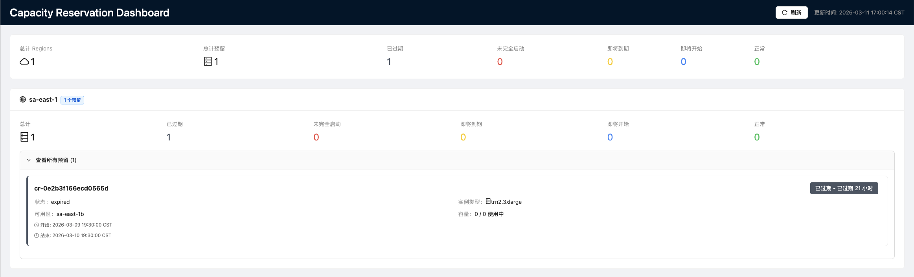

[English](README_EN.md) | 中文

# Capacity Reservation Notifier

本项目基于 AWS Serverless 架构，实现跨区域 Capacity Blocks 到期提前预警、未开机 CB 闲置监控，助力客户避免业务中断与成本浪费。

## 解决方案与核心功能

本项目采用无服务器架构，实现全自动化部署与运行，核心能力包括：

- 跨区域自动化扫描

系统每日多次批量扫描客户账号下所有 Region 的 Capacity Blocks 资源，自动汇总预订信息、到期时间、使用状态，形成统一资源视图。

- 到期主动预警推送

按预设周期生成 CB 到期报表，通过邮件自动推送告警信息，让客户提前规划业务停机与资源迁移，避免因回收预警过晚导致业务影响。

- CB-EC2 实例自动关联

提供专用映射脚本，自动建立 CB 预订与对应 EC2 实例的关联关系，精准识别需重点保障与迁移的目标实例，简化资产处置流程。

- 未开机 CB 专项监控

新增对已计费但未启动 EC2 的 CB 资源监控能力，及时识别闲置资源并告警，提醒客户开机或调整资源策略，杜绝无效成本损耗。

- 实时 Web Dashboard

提供可视化实时监控Dashboard，支持按region分组查看所有CB状态，根据紧急程度使用颜色标识（红色/黄色/蓝色/绿色），并支持点击查看CB关联的EC2实例详情。


## 项目背景
AWS Capacity Blocks（CB）为客户提供专属算力预订能力，但原生机制存在明显使用短板：默认仅在实例回收前 30 分钟发出告警，预留时间过短，客户无法完成业务停机、服务切换、数据迁移等标准化流程，极易引发业务中断与资产风险。

同时客户在日常运维中面临三大核心痛点：

- 人工成本高：需跨多个 Region 手动核查预订到期情况，操作繁琐、效率低下；

- 资源关联难：无法将 CB 预订与对应 EC2 实例直接映射，到期前迁移工作难以推进；

- 成本易浪费：已计费的 CB 资源常因 EC2 实例未及时开机而闲置，造成不必要费用支出。


## 效果

### 邮件通知


- 每天北京时间 08:00 和 18:00 自动扫描所有 AWS regions 的 active Capacity Reservations
- 通过 SNS 发送邮件通知
- 所有日志记录到 CloudWatch Logs

### 实时Dashboard



- 实时查看所有region的Capacity Reservations
- 颜色标识：🔴红色（未完全启动）、🟡黄色（即将到期）、🔵蓝色（即将开始）、🟢绿色（正常）
- 点击CB查看关联的EC2实例列表
- 自动刷新（每5分钟）


## 架构


### 邮件通知组件
- **EventBridge Scheduler**: 定时触发（每天 2 次）
- **Notification Lambda**: 扫描 Capacity Reservations 并发送通知
- **SNS Topic**: 邮件通知
- **CloudWatch Logs**: 日志记录（保留 30 天）

### Dashboard组件
- **API Gateway**: REST API（支持API Key认证）
- **API Lambda**: 实时查询CB和EC2实例
- **React Frontend**: 可视化Dashboard（通过Amplify部署）
- **共享模块**: EC2查询、状态计算逻辑

## 前置要求

### 后端部署
- Python 3.11+
- AWS CLI 已配置
- AWS CDK 已安装：`npm install -g aws-cdk`

### 前端部署（可选）
- Node.js 16+
- npm 或 yarn


## 部署

请使用CloudShell进行部署


1. Bootstrap CDK（首次部署）：
```bash
cd capacity-reservation-notifier

pip install -r requirements.txt

cdk bootstrap
```

2. 合成 CloudFormation 模板：
```bash
cdk synth
```

3. 部署 Stack：
```bash
cdk deploy
```

4. 记录CDK输出信息：
   - `SNS_TOPIC_ARN` - 用于邮件订阅
   - `ApiEndpoint` - API Gateway端点（Dashboard使用）
   - `ApiKeyId` - API Key ID

5. 创建 SNS 邮件订阅：
```bash
aws sns subscribe \
  --topic-arn <SNS_TOPIC_ARN> \
  --protocol email \
  --notification-endpoint <YOUR_EMAIL>
```

6. 确认邮件订阅（检查邮箱并点击确认链接）

7. 获取API Key（用于Dashboard）：
```bash
aws apigateway get-api-keys --include-values \
  --query "items[?name=='capacity-reservation-dashboard-key'].value" \
  --output text
```


## Dashboard 前端部署

Dashboard提供实时可视化监控界面，支持本地开发和AWS Amplify生产部署。

### 本地开发

1. 进入前端目录：
```bash
cd dashboard-frontend
```

2. 安装依赖：
```bash
npm install
```

3. 配置环境变量：
```bash
cp .env.example .env
```

编辑 `.env` 文件，填入后端API信息：
```
REACT_APP_API_ENDPOINT=https://xxxxxx.execute-api.region.amazonaws.com/prod
REACT_APP_API_KEY=your-api-key-here
```

4. 启动开发服务器：
```bash
npm start
```

访问 http://localhost:3000 查看Dashboard。

### 生产部署（AWS Amplify）

1. 进入前端目录并安装依赖：
```bash
cd dashboard-frontend
npm install
```

2. 配置环境变量（构建前必须配置）：
```bash
cp .env.example .env
```

编辑 `.env` 文件，填入生产环境API信息：
```
REACT_APP_API_ENDPOINT=https://xxxxxx.execute-api.region.amazonaws.com/prod
REACT_APP_API_KEY=your-api-key-here
```

3. 构建生产版本：
```bash
npm run build
```

4. 压缩构建文件：
```bash
cd build
zip -r ../dashboard.zip .
cd ..
```

5. 登录 [AWS Amplify Console](https://console.aws.amazon.com/amplify/)

6. 点击 **Get Started** → **Amplify Hosting** → **Deploy without Git provider**

7. 应用名称输入 `capacity-reservation-dashboard`，环境名称 `production`

8. 拖拽上传 `dashboard.zip` 文件或点击选择文件上传

9. 点击 **Save and deploy**

10. 部署完成后，记录Amplify域名（如 `https://production.xxxxx.amplifyapp.com`）

**参考文档**: [AWS Amplify Manual Deploys](https://docs.aws.amazon.com/amplify/latest/userguide/manual-deploys.html)

## Mock模式（测试用）

如果没有真实的Capacity Block资源，可以启用Mock模式查看Demo效果：

1. Lambda函数已默认启用Mock模式（`ENABLE_MOCK_DATA=true`）
2. Mock数据包含6个模拟CB，覆盖所有状态类型
3. Dashboard会显示模拟的4个region和各种颜色状态的CB
4. 详细说明见：[MOCK_MODE.md](MOCK_MODE.md)

生产环境部署时，记得关闭Mock模式：
```python
# 在 capacity_reservation_notifier_stack.py 中修改
"ENABLE_MOCK_DATA": "false"
```

## 测试

### 测试邮件通知

手动触发 Notification Lambda：

```bash
aws lambda invoke \
  --function-name CapacityReservationNotifierStack-CapacityReservationNotifier \
  --output json \
  response.json
```

### 测试API

```bash
# 测试获取所有CB
curl -H "x-api-key: YOUR_API_KEY" \
  "YOUR_API_ENDPOINT/api/capacity-reservations"

# 测试获取实例
curl -H "x-api-key: YOUR_API_KEY" \
  "YOUR_API_ENDPOINT/api/capacity-reservations/cr-xxxxx/instances?region=us-east-1"
```

## 成本

### 后端（邮件通知 + API）
- Lambda执行：$0.00（免费套餐内）
- API Gateway：$0.00-$1.00（取决于调用次数）
- SNS：$0.00（免费套餐内）
- CloudWatch Logs：$0.03

**预计月度成本：~$0.05**（几乎全部在免费套餐内）

### 前端（Dashboard）
- AWS Amplify：$0.00（免费套餐包含1000构建分钟和15GB流量）
- 超出免费套餐后约$0.01/GB流量

## 项目结构

```
capacity_reservation_notifier/
├── lambda/                              # Lambda函数代码
│   ├── handler.py                      # 邮件通知Lambda
│   ├── api_handler.py                  # Dashboard API Lambda
│   └── common/                         # 共享模块
│       ├── ec2_service.py             # EC2查询服务
│       ├── status_calculator.py       # 状态计算
│       └── mock_data.py               # Mock数据生成器
├── capacity_reservation_notifier/      # CDK Stack定义
│   └── capacity_reservation_notifier_stack.py
├── dashboard-frontend/                 # React Dashboard
│   ├── src/
│   │   ├── components/                # React组件
│   │   ├── services/                  # API服务
│   │   ├── hooks/                     # React Hooks
│   │   └── types/                     # TypeScript类型
│   ├── package.json
│   └── README.md
├── README.md                           # 本文件
├── MOCK_MODE.md                        # Mock模式说明
└── app.py                              # CDK应用入口
```

## 许可证

MIT-0, 请看 LICENSE 文件。

## Security

更多信息，请看 [CONTRIBUTING](CONTRIBUTING.md#security-issue-notifications).

