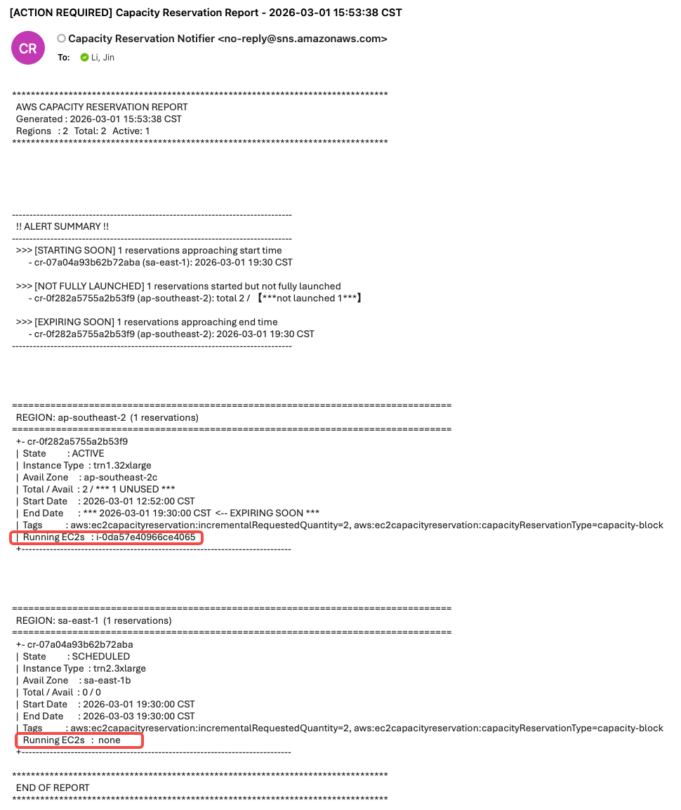
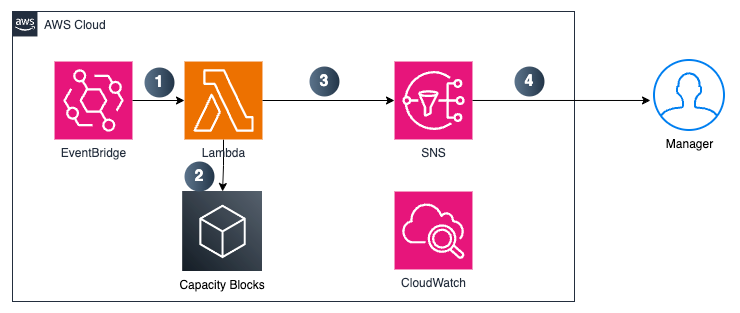

English | [中文](README.md)

# Capacity Reservation Notifier

A serverless solution on AWS that provides proactive expiration alerts for Capacity Blocks across regions and monitors idle CB resources to help customers avoid service disruptions and cost waste.

## Features

- **Cross-Region Automated Scanning** — Scans all Capacity Blocks across all AWS regions multiple times daily, aggregating reservation info, expiration times, and usage status into a unified view.

- **Proactive Expiration Alerts** — Generates CB expiration reports on a scheduled basis and sends email alerts, giving customers time to plan shutdowns and resource migrations before the default 30-minute warning.

- **CB-EC2 Instance Mapping** — Automatically maps CB reservations to their corresponding EC2 instances, identifying instances that need migration or protection.

- **Idle CB Monitoring** — Detects billed but unstarted EC2 instances within CB reservations, alerting customers to start instances or adjust resource strategy to eliminate wasted spend.

## Background

AWS Capacity Blocks provide dedicated compute reservations, but the native mechanism only sends alerts 30 minutes before instance reclamation — far too short for customers to complete standard shutdown, service migration, or data transfer procedures.

Key pain points this solution addresses:

- **High manual effort**: Checking reservation expiration across multiple regions is tedious and error-prone.
- **No resource mapping**: No native way to link CB reservations to specific EC2 instances for pre-expiration migration planning.
- **Cost waste**: Billed CB resources often sit idle when EC2 instances aren't started in time.

## Preview



- Automatically scans all active Capacity Reservations across all AWS regions at 08:00 and 18:00 CST daily
- Sends email notifications via SNS
- All logs stored in CloudWatch Logs

## Architecture



- **EventBridge Scheduler**: Triggers the function twice daily
- **Lambda Function**: Scans Capacity Reservations and sends notifications
- **SNS Topic**: Email notifications
- **CloudWatch Logs**: Log retention for 30 days

## Prerequisites

- Python 3.11+
- AWS CLI configured
- AWS CDK installed: `npm install -g aws-cdk`

## Deployment

It is recommended to deploy using AWS CloudShell.

1. Bootstrap CDK (first-time only):
```bash
cd capacity-reservation-notifier
pip install -r requirements.txt
cdk bootstrap
```

2. Synthesize the CloudFormation template:
```bash
cdk synth
```

3. Deploy the stack:
```bash
cdk deploy
```

4. Note the SNS Topic ARN from the stack outputs.

5. Subscribe an email to the SNS topic:
```bash
aws sns subscribe \
  --topic-arn <SNS_TOPIC_ARN> \
  --protocol email \
  --notification-endpoint <YOUR_EMAIL>
```

6. Confirm the subscription by clicking the link in the confirmation email.

## Testing

Manually invoke the Lambda function to test:

```bash
aws lambda invoke \
  --function-name CapacityReservationNotifierStack-CapacityReservationNotifier \
  --output json \
  response.json
```

## Cost

Estimated monthly cost: ~$0.03 (almost entirely within the AWS Free Tier)

## Security

See [CONTRIBUTING](CONTRIBUTING.md) for contribution guidelines.

## License

This library is licensed under the MIT-0 License. See the [LICENSE](LICENSE) file.
