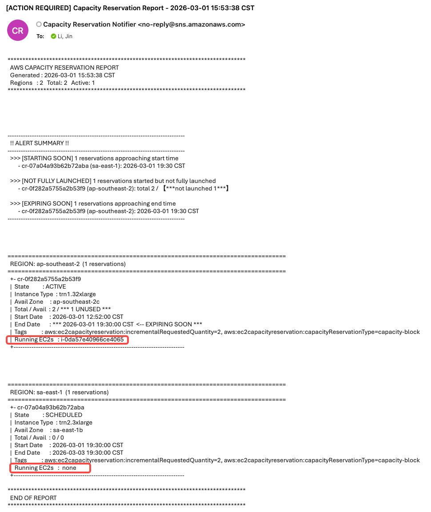
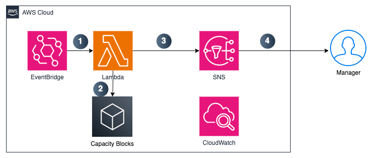

English | [中文](README.md)

# Capacity Reservation Notifier

A serverless solution on AWS that provides proactive expiration alerts for Capacity Blocks across regions and monitors idle CB resources to help customers avoid service disruptions and cost waste.

## Features

- **Cross-Region Automated Scanning** — Scans all Capacity Blocks across all AWS regions multiple times daily, aggregating reservation info, expiration times, and usage status into a unified view.

- **Proactive Expiration Alerts** — Generates CB expiration reports on a scheduled basis and sends email alerts, giving customers time to plan shutdowns and resource migrations before the default 30-minute warning.

- **CB-EC2 Instance Mapping** — Automatically maps CB reservations to their corresponding EC2 instances, identifying instances that need migration or protection.

- **Idle CB Monitoring** — Detects billed but unstarted EC2 instances within CB reservations, alerting customers to start instances or adjust resource strategy to eliminate wasted spend.

- **Real-time Web Dashboard** — Provides a visual monitoring dashboard with real-time CB status across all regions, color-coded by urgency (red/yellow/blue/green), and supports clicking to view associated EC2 instances.

## Background

AWS Capacity Blocks provide dedicated compute reservations, but the native mechanism only sends alerts 30 minutes before instance reclamation — far too short for customers to complete standard shutdown, service migration, or data transfer procedures.

Key pain points this solution addresses:

- **High manual effort**: Checking reservation expiration across multiple regions is tedious and error-prone.
- **No resource mapping**: No native way to link CB reservations to specific EC2 instances for pre-expiration migration planning.
- **Cost waste**: Billed CB resources often sit idle when EC2 instances aren't started in time.

## Preview

### Email Notifications


- Automatically scans all active Capacity Reservations across all AWS regions at 08:00 and 18:00 CST daily
- Sends email notifications via SNS
- All logs stored in CloudWatch Logs

### Real-time Dashboard
- View all Capacity Reservations across regions in real-time
- Color-coded status: 🔴 Red (not fully launched), 🟡 Yellow (expiring soon), 🔵 Blue (starting soon), 🟢 Green (normal)
- Click on CB to view associated EC2 instances
- Auto-refresh every 5 minutes

## Architecture



### Email Notification Components
- **EventBridge Scheduler**: Triggers the function twice daily
- **Notification Lambda**: Scans Capacity Reservations and sends notifications
- **SNS Topic**: Email notifications
- **CloudWatch Logs**: Log retention for 30 days

### Dashboard Components
- **API Gateway**: REST API with API Key authentication
- **API Lambda**: Real-time query for CB and EC2 instances
- **React Frontend**: Visual dashboard (deployed via Amplify)
- **Shared Modules**: EC2 query and status calculation logic

## Prerequisites

### Backend Deployment
- Python 3.11+
- AWS CLI configured
- AWS CDK installed: `npm install -g aws-cdk`

### Frontend Deployment (Optional)
- Node.js 16+
- npm or yarn

## Deployment

It is recommended to deploy using AWS CloudShell.

1. Bootstrap CDK (first-time only):
```bash
cd capacity-reservation-notifier
pip install -r requirements.txt
cdk bootstrap
```

2. Synthesize the CloudFormation template:
```bash
cdk synth
```

3. Deploy the stack:
```bash
cdk deploy
```

4. Note the CDK outputs:
   - `SNS_TOPIC_ARN` - For email subscription
   - `ApiEndpoint` - API Gateway endpoint (for Dashboard)
   - `ApiKeyId` - API Key ID

5. Subscribe an email to the SNS topic:
```bash
aws sns subscribe \
  --topic-arn <SNS_TOPIC_ARN> \
  --protocol email \
  --notification-endpoint <YOUR_EMAIL>
```

6. Confirm the subscription by clicking the link in the confirmation email.

7. Retrieve the API Key (for Dashboard):
```bash
aws apigateway get-api-keys --include-values \
  --query "items[?name=='capacity-reservation-dashboard-key'].value" \
  --output text
```

## Dashboard Frontend Deployment

The Dashboard provides a real-time visual monitoring interface, supporting local development and AWS Amplify production deployment.

### Local Development

1. Navigate to the frontend directory:
```bash
cd dashboard-frontend
```

2. Install dependencies:
```bash
npm install
```

3. Configure environment variables:
```bash
cp .env.example .env
```

Edit `.env` file with your backend API information:
```
REACT_APP_API_ENDPOINT=https://xxxxxx.execute-api.region.amazonaws.com/prod
REACT_APP_API_KEY=your-api-key-here
```

4. Start the development server:
```bash
npm start
```

Visit http://localhost:3000 to view the Dashboard.

### Production Deployment (AWS Amplify)

1. Navigate to frontend directory and install dependencies:
```bash
cd dashboard-frontend
npm install
```

2. Configure environment variables (must be set before build):
```bash
cp .env.example .env
```

Edit `.env` file with production API information:
```
REACT_APP_API_ENDPOINT=https://xxxxxx.execute-api.region.amazonaws.com/prod
REACT_APP_API_KEY=your-api-key-here
```

3. Build for production:
```bash
npm run build
```

4. Create deployment archive:
```bash
cd build
zip -r ../dashboard.zip .
cd ..
```

5. Log in to [AWS Amplify Console](https://console.aws.amazon.com/amplify/)

6. Click **Get Started** → **Amplify Hosting** → **Deploy without Git provider**

7. Enter app name: `capacity-reservation-dashboard`, environment: `production`

8. Drag and drop `dashboard.zip` or click to upload

9. Click **Save and deploy**

10. After deployment, note your Amplify domain (e.g., `https://production.xxxxx.amplifyapp.com`)

**Reference**: [AWS Amplify Manual Deploys](https://docs.aws.amazon.com/amplify/latest/userguide/manual-deploys.html)

## Mock Mode (For Testing)

If you don't have real Capacity Block resources, enable Mock mode to view demo data:

1. Lambda functions have Mock mode enabled by default (`ENABLE_MOCK_DATA=true`)
2. Mock data includes 6 simulated CBs covering all status types
3. Dashboard will display simulated data for 4 regions with various colored statuses
4. See detailed documentation: [MOCK_MODE.md](MOCK_MODE.md)

For production deployment, remember to disable Mock mode:
```python
# In capacity_reservation_notifier_stack.py
"ENABLE_MOCK_DATA": "false"
```

## Testing

### Test Email Notifications

Manually invoke the Notification Lambda:

```bash
aws lambda invoke \
  --function-name CapacityReservationNotifierStack-CapacityReservationNotifier \
  --output json \
  response.json
```

### Test API

```bash
# Test get all CBs
curl -H "x-api-key: YOUR_API_KEY" \
  "YOUR_API_ENDPOINT/api/capacity-reservations"

# Test get instances
curl -H "x-api-key: YOUR_API_KEY" \
  "YOUR_API_ENDPOINT/api/capacity-reservations/cr-xxxxx/instances?region=us-east-1"
```

## Cost

### Backend (Email Notifications + API)
- Lambda execution: $0.00 (within Free Tier)
- API Gateway: $0.00-$1.00 (depends on request volume)
- SNS: $0.00 (within Free Tier)
- CloudWatch Logs: $0.03

**Estimated monthly cost: ~$0.05** (mostly within Free Tier)

### Frontend (Dashboard)
- AWS Amplify: $0.00 (Free Tier includes 1000 build minutes and 15GB bandwidth)
- Beyond Free Tier: ~$0.01/GB bandwidth

## Project Structure

```
capacity_reservation_notifier/
├── lambda/                              # Lambda function code
│   ├── handler.py                      # Email notification Lambda
│   ├── api_handler.py                  # Dashboard API Lambda
│   └── common/                         # Shared modules
│       ├── ec2_service.py             # EC2 query service
│       ├── status_calculator.py       # Status calculation
│       └── mock_data.py               # Mock data generator
├── capacity_reservation_notifier/      # CDK Stack definition
│   └── capacity_reservation_notifier_stack.py
├── dashboard-frontend/                 # React Dashboard
│   ├── src/
│   │   ├── components/                # React components
│   │   ├── services/                  # API services
│   │   ├── hooks/                     # React Hooks
│   │   └── types/                     # TypeScript types
│   ├── package.json
│   └── README.md
├── README.md                           # Chinese documentation
├── README_EN.md                        # This file
├── MOCK_MODE.md                        # Mock mode documentation
└── app.py                              # CDK application entry
```

## Security

See [CONTRIBUTING](CONTRIBUTING.md) for contribution guidelines.

## License

This library is licensed under the MIT-0 License. See the [LICENSE](LICENSE) file.
